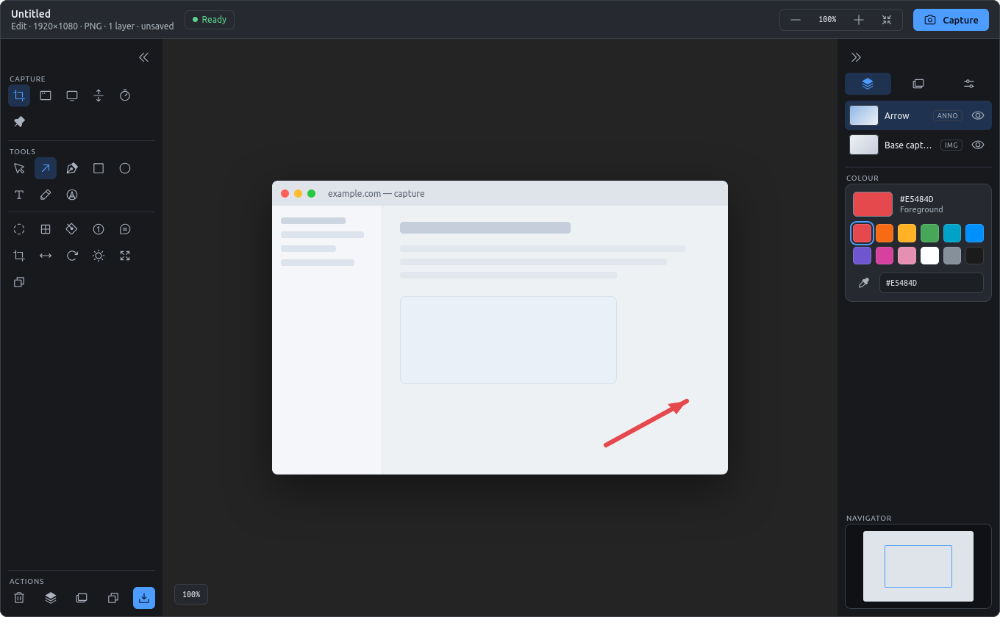
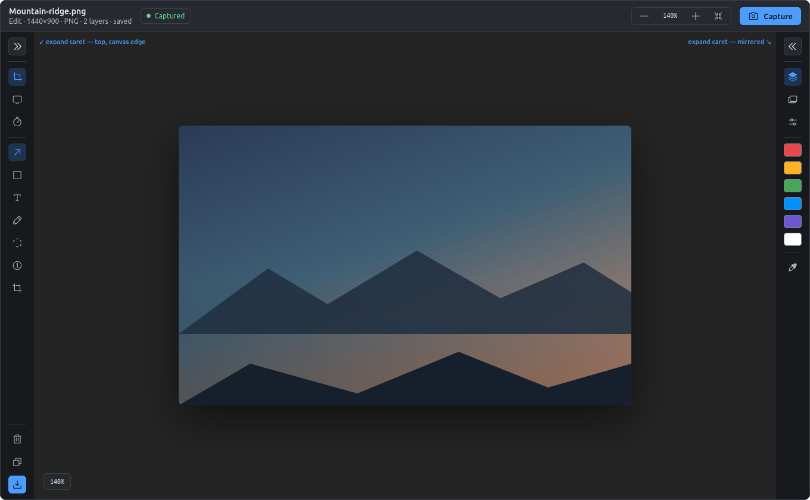
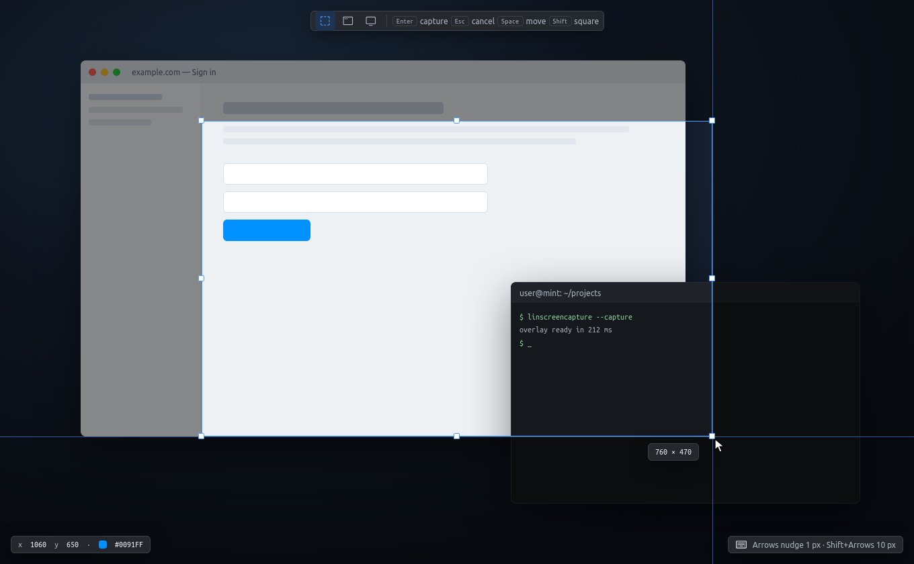
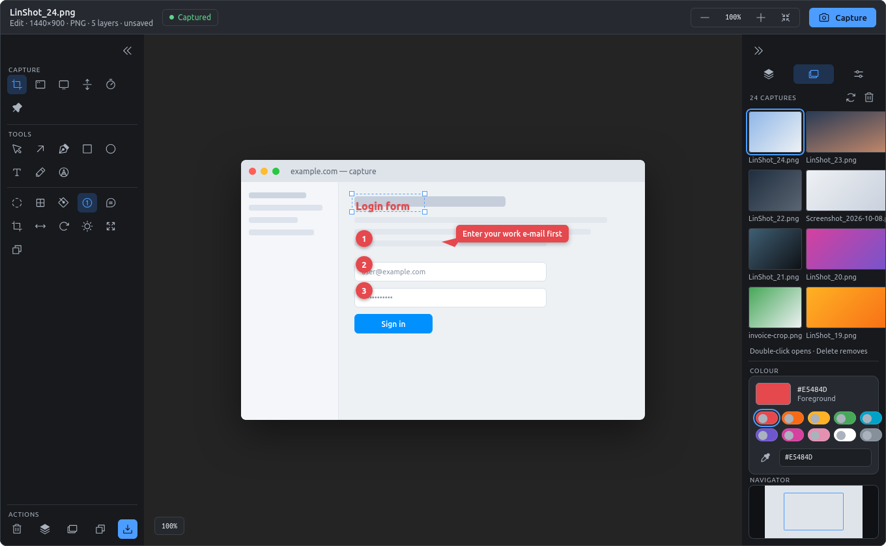
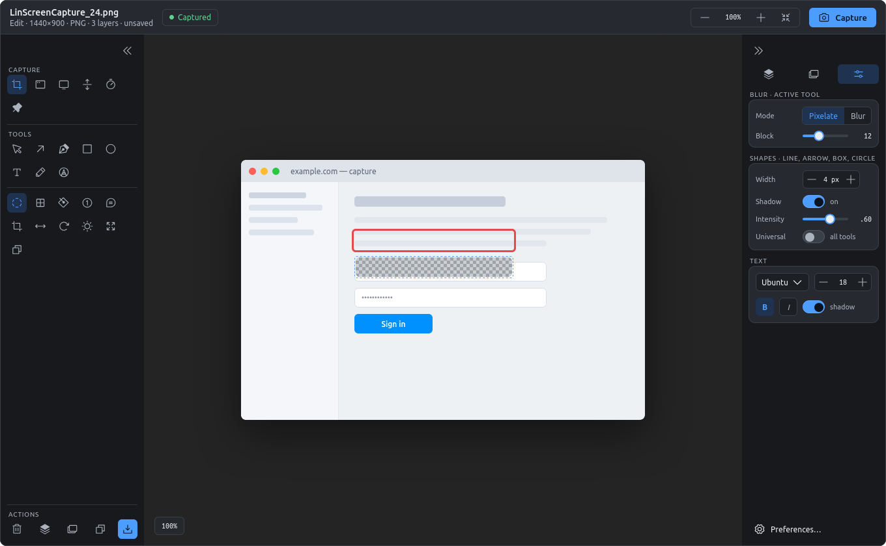
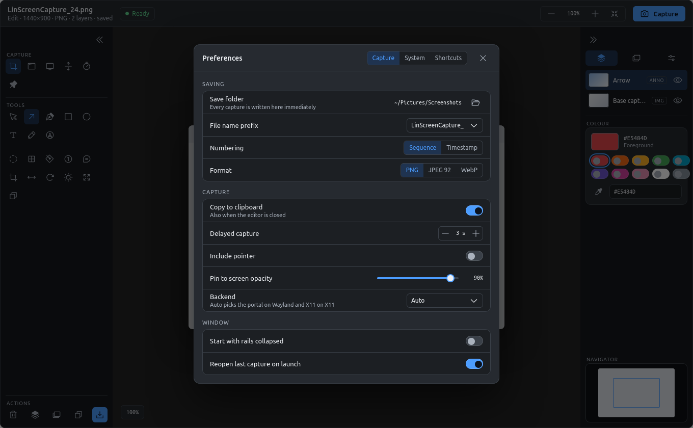
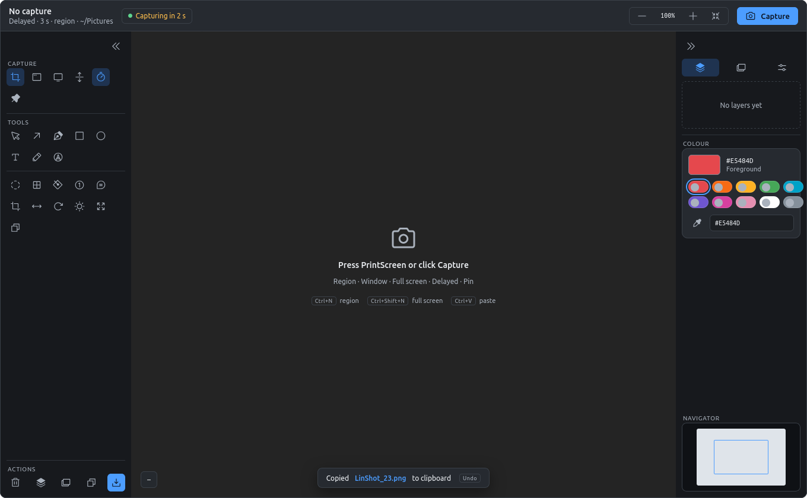
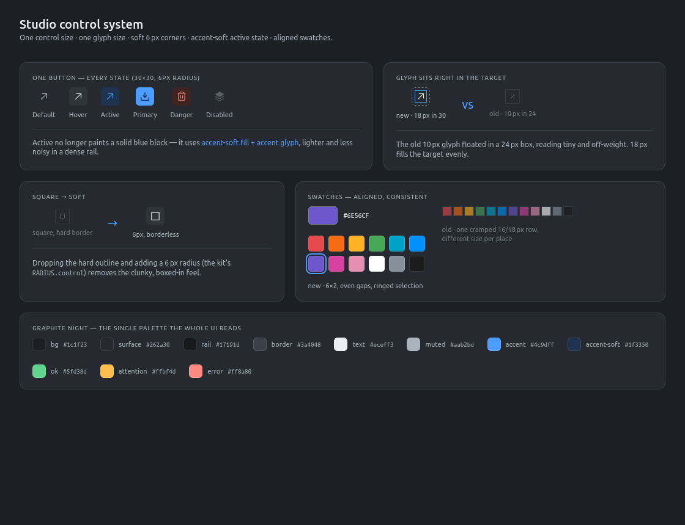
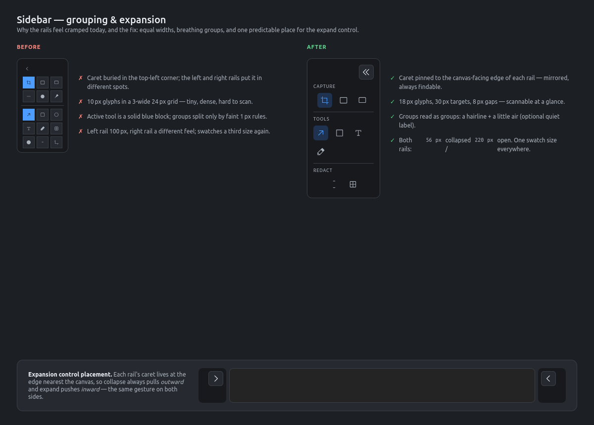

# LinScreenCapture 2

A screenshot studio for Linux, rebuilt from the ground up on **GTK 4 + Python**. Capture a region, window or screen with one key, and land straight in an editor with arrows, boxes, text, step numbers, callouts, blur and crop, all on a dark "Graphite Night" interface with one control size, one glyph size and soft corners.

**Status:** version 2.0, Phases 1–3 of 7 are implemented: the Studio shell, the document/annotation/undo model with settings migration, and capture (region, window, full screen on X11; portal and CLI backends for other sessions) with save, clipboard and the editor showing the result. Annotation tools arrive in Phase 4. The screenshots below are high-fidelity mockups rendered from the design canvas; they are the contract the application is built against, and `screenshots/dev/` holds renders of the running shell for comparison. Version 1.4.0 (C / GTK 3) lives in the [original repository](https://github.com/MensuraMedia/linscreencapture).

| | |
| --- | --- |
| Design canvas | [LinScreenCapture 2 — Studio Redesign Mockups](https://claude.ai/artifact/NTRyK2yrrpnhbW6sUmnBoA) |
| Technical specification | [docs/GUI_SPEC.md](docs/GUI_SPEC.md) (living copy: [Claude Doc](https://claude.ai/code/artifact/5e6387bf-76b0-45f6-9874-a6ba13f90732)) |
| Artboard sources | [docs/mockups/](docs/mockups/) (`*.dc.html`, plus the generator for the feature boards) |
| Stack | Python 3.12 · GTK 4.14 · libadwaita 1.5 · Cairo · Pillow · python-xlib · XDG portal |
| Licence | CC BY-NC 4.0 |

## The Studio Editor



One window, three zones. A 52 px header carries the file name and status, a zoom pill and the single filled **Capture** button. The left rail groups **Capture**, **Tools** and **Actions**; the right rail switches between **Layers**, **Captures** and **Props** above a colour card and a navigator. The stage shows the capture at 1:1 with a zoom HUD.

### Rails collapse to 56 px



Both rails share one width: 220 px open, 56 px collapsed. The expand caret always sits at the canvas-facing edge, so collapse pulls outward and expand pushes inward on both sides. Collapsing hands 164 px per side back to the stage. The active tool is always visible in the collapsed rail.

### Capture overlay



The screen freezes, a veil dims everything outside the selection, and a crosshair follows the pointer. The top bar switches between Region, Window and Full screen without leaving the overlay and lists the keys: **Enter** captures, **Esc** cancels, **Space** moves the rectangle, **Shift** constrains to a square. Eight handles resize the selection, arrows nudge by 1 px (Shift+arrows by 10 px), and the chips show the pointer position and the colour under it.

### Step numbers, callouts and text



Every annotation is a layer. Step numbers renumber themselves when one is deleted, callouts carry their own text, and selected text shows resize handles. The save folder is browsed in the **Library**, a full-stage page (this mockup still shows the earlier right-rail panel): double-click opens a file in the editor, Delete removes it after confirmation.

### Redaction and per-tool settings



Blur and pixelate are layers too, so they can be moved and undone. The **Props** panel shows the settings of the active tool (mode and block size here), the shared shape settings (width, shadow, intensity, a universal switch that applies them to every tool) and the text settings (family, size, bold, italic, shadow).

### Preferences



Save folder, file name prefix, numbering scheme, format, clipboard behaviour, delayed capture, pointer inclusion, pin opacity, capture backend and window defaults. The System page holds the PrintScreen hotkey presets and autostart; the Shortcuts page lists every key.

### Empty state, delayed capture and toasts



Before the first capture the stage explains the three ways to start. The status chip counts down a delayed capture, and toasts confirm copies and saves with an Undo.

### The control system





One 30 × 30 control, one 18 px glyph, 6 px corners, an accent-soft active state instead of a solid blue block, and 26 px swatches on a 6-column grid. Groups read as groups: a hairline, a little air and a quiet uppercase label.

## Features

**Capture**

- Region, window and full-screen capture; delayed capture with a visible countdown; pin a capture to the screen as a floating window.
- Scrolling capture (stitches successive segments while you scroll), scheduled for milestone 7.
- Every capture is saved to the configured folder **and** copied to the clipboard before the editor opens. Esc leaves no file behind.
- Backends chosen at start-up: XDG desktop portal (Wayland and X11), python-xlib on X11, `gnome-screenshot` / `grim` as a last resort.
- One resident instance; the system PrintScreen binding and `linscreencapture --capture` activate it over D-Bus in under 300 ms.

**Annotate**

- Select, Move, Arrow, Line, Box, Circle, Text, Pen, Marker, Step number, Callout, Fill.
- Blur and Pixelate redaction as movable layers; Crop with live dimensions; Resize, Rotate and Flip; Brightness, Contrast, Grayscale and Invert with live preview.
- Layers panel with thumbnails, kind badges, visibility toggles and drag reordering; Flatten merges everything into the base image.
- Undo and Redo, 20 levels deep, across annotations and image operations.
- Shift-drag snaps lines and arrows to 45°; Ctrl-drag constrains boxes and circles; Ctrl+V pastes an image as a new layer.

**Colour**

- Twelve round swatches sitting directly in the rail with an accent ring on the current colour, a custom-colour button and an eyedropper that samples from the stage; the collapsed rail keeps the first six one click away.

**Files**

- Sequential or timestamped names with a configurable prefix (`LinScreenCapture_12.png`, `Screenshot_2026-10-08.png`); PNG, JPEG and WebP.
- Library: a full-stage page of the save folder, newest first, with large thumbnails, names and dates; open, refresh and delete (left-rail Library button or Ctrl+L).
- Settings migrate automatically from LinScreenCapture 1.x (legacy `~/.config/linshot/settings.conf`).

**Interface**

- Graphite Night dark theme shipped as one GTK 4 stylesheet; identical on every desktop.
- Phosphor Icons (regular weight) bundled as symbolic icons in a GResource; 46 glyphs, recoloured by CSS.
- Keyboard-first: single-letter tool keys, Ctrl+[ / Ctrl+] for the rails, Ctrl+0 fit, Ctrl+1 1:1, F1 shortcuts window.
- Toasts instead of dialogs for Copied, Saved and errors; dialogs only for Flatten, Delete and unsaved changes.

## What changed from 1.4

| 1.4 (C / GTK 3) | 2.0 (Python / GTK 4) |
| --- | --- |
| Five tabs: Image, Files, Tools, Settings, About | One Studio window: rails, stage, panels, preferences dialog |
| 16 labelled sidebar buttons, 24 px targets, 10 px hand-drawn Cairo glyphs | 30 px targets, 18 px Phosphor glyphs, grouped with hairlines and labels |
| X11 only (`XGetImage`) | Portal, X11 and CLI backends; works on Wayland |
| Lock file + SIGUSR1 single instance | `Gio.Application` activation over D-Bus |
| Annotations drawn into one list | Layers with thumbnails, visibility, reordering |
| Blur, Border, Resize, Rotate, Bright as modal tools | Blur and Pixelate as layers; Resize, Rotate, Brightness as popovers with live preview |
| — | Step numbers, callouts, marker, fill, pin to screen, delayed capture, navigator, toasts |
| 4,438-line `main_window.c` | Five-layer Python package; the model has no GTK and is unit-tested headless |

## Keyboard shortcuts

| Shortcut | Action |
| --- | --- |
| PrintScreen (system) | Region capture |
| Ctrl+N / Ctrl+Shift+N | Region capture / Full-screen capture |
| Ctrl+S / Ctrl+Shift+S | Save / Save As |
| Ctrl+C / Ctrl+V | Copy composition or selection / Paste image as a layer |
| Ctrl+Z / Ctrl+Shift+Z | Undo / Redo |
| Ctrl+D · Delete | Duplicate layer · Delete layer or capture file |
| V A L B C T P M | Select, Arrow, Line, Box, Circle, Text, Pen, Marker |
| U X N K | Blur, Pixelate, Step number, Crop |
| Ctrl+scroll · Ctrl+0 · Ctrl+1 | Zoom · Fit · 1:1 |
| Ctrl+[ / Ctrl+] | Toggle left / right rail |
| Ctrl+L | Library page |
| Ctrl+, · F1 | Settings · Shortcuts window |
| Esc | Cancel overlay, crop or text; clear selection |

## Architecture

```
linscreencapture/
  app/        Adw.Application + GActions, EditorController, ViewState
  ui/         StudioWindow, rails, stage, capture overlay, preferences, widgets, style.css
  model/      Document, Annotations, UndoStack, Settings, CapturesIndex   (pure Python)
  services/   CaptureService, Clipboard, FileStore, HotkeyRegistrar, IconLoader
  backends/   portal, x11, cli
data/         icons (Phosphor, -symbolic), gresource.xml, .desktop
docs/         GUI_SPEC.md, mockups/
tests/
```

Each layer imports only the layer below it. The model has no GTK, so annotations, undo and settings run under plain `pytest`; widget tests run under `xvfb-run`. The full specification, including every control's icon file and action name, the CSS tokens and the acceptance criteria per milestone, is in [docs/GUI_SPEC.md](docs/GUI_SPEC.md).

## Development setup

```bash
sudo apt install python3-gi python3-gi-cairo gir1.2-gtk-4.0 gir1.2-adw-1 python3-cairo \
                 python3-pil python3-xlib xdg-desktop-portal xdg-desktop-portal-gtk xclip \
                 libglib2.0-dev-bin fonts-ubuntu
git clone https://github.com/MensuraMedia/linscreencapture3.git
cd linscreencapture3
make resources                 # compiles data/ + style.css into linscreencapture/linscreencapture.gresource
python3 -m linscreencapture    # or: pip install -e .[dev] && linscreencapture
```

Start-up and capture diagnostics: `python3 -m linscreencapture --debug` (or `LSC_DEBUG=1`) prints timestamped lines for toolkit versions, resources, settings, backend order, window build time and every capture step, and routes GTK/GLib messages into the same stream.

`make icons` re-syncs the 51 bundled Phosphor glyphs from a local checkout (`ICON_SRC=~/projects/assets/icons/regular`); the SVGs are committed, so a plain clone builds without it. `make test` runs the suite (under Xvfb when `xvfb-run` is installed, otherwise on the live display) and `make snapshot` renders the shell to `screenshots/dev/` for side-by-side comparison with the mockups.

Shell adjustments made after Phase 1 are documented in `docs/SHELL-ADJUSTMENTS-2026-10-08.md` and `docs/TOOL-PLACEMENT.md` (Capture tops the left rail, tool properties live in the header, zoom and Copy/Flatten in the right rail); `screenshots/dev/` shows the running shell.

Window chrome: the Graphite header is the window's title bar (client-side decoration). The minimise / maximise / close buttons follow the desktop's `gtk-decoration-layout`, dragging the header moves the window and double-click maximises. Both rails collapse automatically below 1100 px window width and reopen above it unless you toggled them by hand (Ctrl+[ / Ctrl+] or the carets); the minimum window is 960×600.

### Regenerating the mockup renders

The feature artboards in `docs/mockups/` are generated from `Main.dc.html` by `docs/mockups/gen_mockups.py` and rendered with headless Firefox:

```bash
firefox --headless --profile /tmp/ffp --no-remote --window-size=1360,840 \
        --screenshot screenshots/01_studio_editor.png file://$PWD/docs/mockups/Main.dc.html
```

## Roadmap

| # | Phase | Done when | Status |
| --- | --- | --- | --- |
| 1 | Layout shell | Window matches the Main and Collapsed artboards; every button has tooltip and action; rails toggle and auto-collapse; tests green | **done** |
| 2 | Model and settings | Headless tests green; 1.x settings migrate | **done** |
| 3 | Capture | Region, window, screen on X11 and Wayland; clipboard and file written before the editor opens | **done** (X11 verified; portal untested) |
| 4 | Annotation tools and layers | Every tool is a layer: drawn, selected, moved, undone | next |
| 5 | Image operations and files | Crop, resize, rotate, brightness, blur, pixelate, flatten, save, copy, captures panel; old C sources removed | |
| 6 | System integration | Hotkey registrar (GNOME-safe), autostart, delayed, pin, scrolling capture, preferences | |
| 7 | Polish and release | Navigator, shortcuts window, toasts, golden-image tests, packaging | |

## Previous version

Screenshots of LinScreenCapture 1.4.0 are kept in [screenshots/v1/](screenshots/v1/). Its C sources remain in `src/` and `include/` as the behavioural reference until milestone 6 reaches parity, then they are removed.

## Credits and licence

Icons: [Phosphor Icons](https://phosphoricons.com) (MIT). Fonts: Ubuntu and Ubuntu Mono.

LinScreenCapture is released under Creative Commons Attribution-NonCommercial 4.0 (CC BY-NC 4.0). Free for education, research and personal projects; commercial use requires permission. See [LICENSE.md](LICENSE.md).

Repository: [github.com/MensuraMedia/linscreencapture3](https://github.com/MensuraMedia/linscreencapture3)
