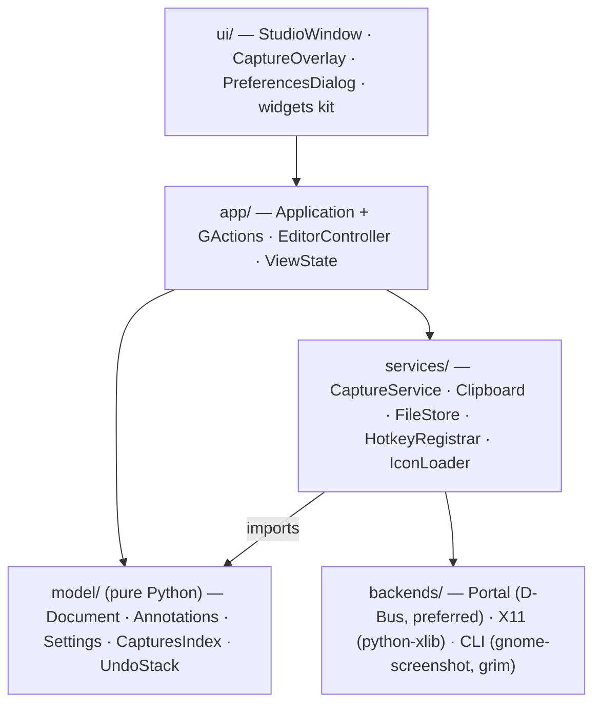
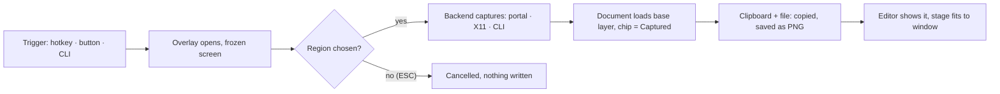

# LinScreenCapture 2 — GTK 4 GUI Technical Specification

As of 2026-10-08. Living copy: https://claude.ai/code/artifact/5e6387bf-76b0-45f6-9874-a6ba13f90732
Design reference: https://claude.ai/artifact/NTRyK2yrrpnhbW6sUmnBoA (LinScreenCapture 2 — Studio Redesign Mockups); rendered artboards in `screenshots/`, sources in `docs/mockups/`

## 1. Purpose and scope

This document is the build specification for LinScreenCapture 2: a ground-up rewrite of the GTK 3 / C screenshot tool as a Python 3 + GTK 4 application whose GUI reproduces the Studio Editor design in the mockup canvas. An implementer with this repository and the Phosphor icon set at `~/projects/assets/icons/regular` should be able to produce the application from this text alone.

**Specified here**

- The window: a 52 px header, two mirrored 220 px rails that collapse to 56 px, and a centre stage, exactly as drawn on the Main and Collapsed artboards.
- Every control, its icon file, its size, its states and its keyboard shortcut.
- The visual system (Graphite Night palette, 30 px controls, 18 px glyphs, 6 px radius) as a GTK 4 CSS provider.
- The non-GUI layers the GUI needs: capture backends, the annotation document model, settings persistence, single-instance and hotkey behaviour, carried over from the existing C code where it is sound.
- An ordered implementation plan with acceptance criteria per milestone.

**Carried over in intent:** capture modes (region, window, full screen), the annotation tool set, undo, crop/resize/rotate/brightness, clipboard-on-capture, sequential save names, the captures browser, settings persistence and the `--capture` single-instance trigger.

**Out of scope:** screen recording to video, cloud upload, OCR; packaging beyond a `.desktop` file and `pyproject.toml`.

**Assumptions:** Linux Mint Cinnamon on X11 first (dev machine: GTK 4.14.5, libadwaita 1.5, Python 3.12), GNOME and KDE on Wayland second via the XDG screenshot portal. Icons are Phosphor Icons (MIT), regular weight, 1,512 SVGs, bundled into a GResource at build time.

## 2. Existing codebase analysis

The repository is a 6,672-line C program on GTK 3, Cairo and raw Xlib (version 1.4.0 Beta, CC BY-NC 4.0). None of its GUI code is reusable in GTK 4 Python, but its behaviour, settings schema and desktop integration are the functional baseline.

| Module (old) | Lines | What it does | Fate |
| --- | --- | --- | --- |
| `src/main_window.c` | 4,438 | Whole GUI: 5-tab notebook, 16-button sidebar, canvas, status bar, GKeyFile settings | Replaced by the Studio Editor window; settings keys preserved |
| `src/editor_tools.c` | 486 | Annotation model (15 tool types), per-tool colour/width/shadow/blur, Cairo drawing | Ported to `model/annotations.py` |
| `src/screen_capture.c` | 106 | `XGetImage` on the root window into an ARGB32 Cairo surface | Becomes the X11 backend (python-xlib); portal backend added |
| `src/capture_overlay.c` | 321 | Full-screen frozen-screen overlay, crosshair, drag rectangle, ESC cancels | Rewritten as `ui/capture_overlay.py` |
| `src/keybinding_manager.c` | 325 | DE detection, PrintScreen registration via gsettings/dconf/xfconf/XGrabKey | Ported; Cinnamon-only hardening caveat kept |
| `src/screenshot_history.c` | 140 | Scan folder, pixbuf thumbnails newest first | Becomes `model/captures_index.py` |
| `src/sidebar_icons.c` | 358 | 17 hand-drawn Cairo icons | Dropped; Phosphor SVGs |
| `src/main.c` | 118 | `/tmp/linscreencapture.lock`, SIGUSR1, `--capture`, 200 ms poll | Replaced by `Gtk.Application` activation and a `capture-region` action |

**Settings schema to preserve** (`~/.config/linscreencapture/settings.conf`, group `[Settings]`; migrated on first run from the legacy 1.x file `~/.config/linshot/settings.conf` to `~/.config/linscreencapture/settings.conf` with the same keys):

| Key | Type | Meaning |
| --- | --- | --- |
| `screenshot_path` | string | Save folder, default `~/Pictures` |
| `filename_format` | int | 0 = `LinScreenCapture_` prefix (was `LinShot_` in 1.x), 1 = `Screenshot_` prefix |
| `auto_number` | int | 0 = sequence number, 1 = timestamp |
| `start_with_os` | bool | Autostart entry |
| `shortcut_key` | int | 0 none, 1 Print, 2 Ctrl+Print, 3 Shift+Print, 4 Ctrl+Shift+S, 5 Ctrl+Alt+S |
| `default_screenshot_app` | bool | Register the system keybinding |
| `<tool>_color/_width/_shadow/_shadow_intensity` | string/double/bool/double | Per tool: line, arrow, box, circle, border, blur |
| `blur_block_size` | int | Pixelate block, 4–32 |
| `text_font_family/_size/_bold/_italic` | string/double/bool/bool | Text tool |

**Behaviour kept:** every capture is saved and copied to the clipboard immediately (`xclip` / `wl-clipboard` recommended for non-GTK paste targets); undo depth 20 across annotations and image ops; zoom 10–1000 % with Ctrl+scroll; Shift-drag snaps to 45°, Ctrl-drag constrains; save dialog proposes `name_1`, `name_2`, ….

**Known problems not to re-introduce** (`KNOWN_ISSUES.md`): GNOME registrar overwrote the user's custom-keybindings list (must append); GNOME 42+ needs `show-screenshot-ui` cleared as well as `screenshot`; Wayland has no `XGrabKey`, the desktop's own shortcut points at `linscreencapture --capture`.

## 3. Design reference

Four artboards; the two editor artboards (1360×840) are the layout contract.

| Artboard | Size | Fixes |
| --- | --- | --- |
| Main — both rails open | 1360×840 | Header, 220 px tool rail, stage with image and zoom HUD, 220 px panel rail (Layers/Captures/Props, Colour card, Navigator) |
| Collapsed | 1360×840 | Both rails 56 px, one 30 px button per row, hairlines, expand caret at the top on the canvas-facing edge, six swatches + eyedropper in the right rail |
| System | 1120×860 | 30×30 control, 18 px glyph, 6 px radius; six button states; 26 px swatches in 6×2 with ringed selection; Graphite Night tokens |
| Anatomy | 1200×860 | Groups = hairline + air + quiet uppercase label; caret always at the canvas edge |

**Header (52 px, surface, 1 px bottom border).** Title block: 14 px/500 file name over 12 px muted `Edit · 1920×1080 · PNG · 1 layer · unsaved`. Status chip (26 px, radius 6, surface, border, 7 px dot): Ready / Captured. Spacer. Zoom pill (30 px, surface, border): zoom-out, 40 px mono value, zoom-in, fit. Far right: the only filled primary button, `Capture` (30 px, padding 0 14, camera glyph, 13 px/500).

**Left rail, open (220 px, rail colour, padding 10).** Collapse button right-aligned. `CAPTURE`: Region (active), Window, Full screen, Scrolling, Delayed 3 s, Pin to screen. Hairline. `TOOLS`: Select, Arrow (active), Line, Box, Circle, Text, Pen, Marker. Hairline. Blur, Pixelate, Fill, Step number, Callout, Crop, Resize, Rotate, Brightness, Move, Duplicate. Spacer. Hairline, `ACTIONS` spread edge to edge: Discard (danger hover), Flatten, Captures, Copy, Save (primary).

**Stage.** Remaining width, `#242424`. Image centred at 1:1, 8 px radius, soft drop shadow. Zoom HUD 16 px from bottom-left: 28 px, translucent surface, mono percentage.

**Right rail, open (220 px).** Collapse button left-aligned. Segmented row: Layers (active), Captures, Props. Layers list: 40 px rows, 40×28 thumb, name, 9 px kind badge (`ANNO`, `IMG`), 26 px eye; selected row accent-soft. Hairline, `COLOUR` card: 54×34 well + mono hex + "Foreground"; 6-column swatch grid; eyedropper + hex entry. Spacer. `NAVIGATOR`: 116 px box with the viewport as an accent rectangle.

**Collapsed (56 px).** Single centred column of 30 px buttons, 8 px gaps, 30 px hairlines. Left: expand caret, Region, Full screen, Delayed | Arrow, Box, Text, Pen, Blur, Step, Crop | spacer | Discard, Copy, Save. Right: expand caret, Layers, Captures, Props | six 30×22 colour chips | Eyedropper. Collapsing a rail hands 164 px to the stage.

**Designer's notes.** One control size (30), one glyph size (18), 6 px corners, accent-soft active state; both rails 56 collapsed / 220 open; caret at the canvas-facing edge.

## 4. Technology stack

Pure Python 3.12 on PyGObject with GTK 4.14 and libadwaita 1.5. libadwaita provides the application class, toasts, alert dialogs, preferences dialog and the dark style manager; every visible widget is styled by the app's own CSS.

| Layer | Choice | Debian package |
| --- | --- | --- |
| Language | Python 3.12, `pyproject.toml`, entry point `linscreencapture` | `python3` |
| Toolkit | GTK 4.14 (`gi.require_version('Gtk','4.0')`) | `gir1.2-gtk-4.0` |
| App shell | libadwaita 1.5: `Adw.Application`, `Adw.ToastOverlay`, `Adw.AlertDialog`, `Adw.StyleManager` (FORCE_DARK), `Adw.PreferencesDialog` | `gir1.2-adw-1` |
| Drawing | Cairo via `Gtk.DrawingArea.set_draw_func`, PyCairo 1.25, Pango text | `python3-cairo`, `python3-gi-cairo` |
| Raster ops | GdkPixbuf load/save/thumbnails; Pillow 10.2 for blur, pixelate, brightness/contrast, rotate | `python3-pil` |
| Capture, X11 | python-xlib 0.33 `root.get_image(...)` → ARGB32 | `python3-xlib` |
| Capture, portal | `org.freedesktop.portal.Screenshot` via `Gio.DBusProxy` (`interactive=false`) | `xdg-desktop-portal`, `xdg-desktop-portal-gtk` |
| Capture, fallback | `gnome-screenshot -f` / `grim -g` subprocess | optional |
| Clipboard | `Gdk.Clipboard.set_texture()` | `xclip` / `wl-clipboard` recommended |
| Settings | `GLib.KeyFile` at `~/.config/linscreencapture/settings.conf`, migrated from the legacy 1.x config | — |
| Hotkey | Port of `keybinding_manager.c` via `Gio.Settings` + gsettings/xfconf-query | — |
| Icons | Phosphor regular compiled into `linscreencapture.gresource` under `/com/mensuramedia/linscreencapture/icons/scalable/actions/` | `libglib2.0-dev-bin` |
| Fonts | Ubuntu / Ubuntu Mono, fallback Cantarell / monospace | `fonts-ubuntu` |
| Tests | `pytest`; `xvfb-run` for widget tests | `python3-pytest`, `xvfb` |

Runtime floor: GTK 4.10 (GridView factories, scroll-controller flags). Start-up with `--capture` under 500 ms: the overlay opens before the main window is realised.

```
sudo apt install python3-gi python3-gi-cairo gir1.2-gtk-4.0 gir1.2-adw-1 python3-cairo python3-pil python3-xlib xdg-desktop-portal xdg-desktop-portal-gtk xclip libglib2.0-dev-bin
cd ~/projects/linscreencapture3
python3 -m venv --system-site-packages .venv && . .venv/bin/activate
pip install -e .[dev]
linscreencapture
```

## 5. Application architecture

Phase 1 (done 2026-10-08) built `app/application.py`, `app/view_state.py`, `model/settings.py` (window/rail subset), `model/captures_index.py`, `services/icon_loader.py`, the whole `ui/` layer as a static shell, `tools/sync_icons.py`, `tools/snapshot_shell.py` and `tests/`. Rail pages are pinned to 220 / 56 px with an EXTERNAL-policy scrolled window and an explicit `hexpand=False`, because any child with `hexpand` would otherwise widen the rail.

One package, `linscreencapture`, in five layers; each layer imports only the one below it and the model imports no GTK, so annotations, undo and settings are testable without a display.



The UI raises `Gio.SimpleAction`s on the application; controllers call services; services hand results to the model; the UI observes the model through `GObject` property notifications.

```
linscreencapture/
  __main__.py            # python -m linscreencapture
  app/
    application.py       # Adw.Application, app id com.mensuramedia.LinScreenCapture, actions
    editor_controller.py # current tool, pointer gestures, selection, undo wiring
    view_state.py        # zoom, rail collapsed flags, active right panel (GObject properties)
  ui/
    studio_window.py     # Gtk.ApplicationWindow: header + rails + stage
    header_bar.py        # title block, status chip, zoom pill, Capture button
    tool_rail.py         # left rail, open and collapsed layouts
    panel_rail.py        # right rail: Layers, Captures, Props, Colour, Navigator
    stage.py             # Gtk.ScrolledWindow + DrawingArea, zoom HUD overlay
    capture_overlay.py   # full-screen region picker
    preferences.py       # Adw.PreferencesDialog
    widgets/             # RailButton, GroupLabel, Hairline, SwatchGrid, LayerRow, ZoomPill, StatusChip
    style.css
  model/
    document.py          # base image + ordered layers + dirty flag + file name
    annotations.py       # Annotation dataclasses and Cairo draw functions
    undo.py              # 20-deep stack of reversible commands
    settings.py          # KeyFile-backed dataclass, migration from the legacy 1.x config
    captures_index.py    # Gio.ListStore of CaptureEntry, newest first
  services/
    capture_service.py   # picks a backend, returns a GdkPixbuf and the region
    clipboard.py
    file_store.py        # naming rules, sequential suffixes, PNG/JPEG save
    hotkey_registrar.py  # port of keybinding_manager.c
    icon_loader.py       # GResource lookup, Gtk.IconTheme.add_resource_path
  backends/
    base.py              # CaptureBackend protocol: capture_screen(), capture_region(rect), capture_window()
    portal.py
    x11.py
    cli.py
data/
  icons/                 # Phosphor SVGs copied at build time, -symbolic suffix
  linscreencapture.gresource.xml
  com.mensuramedia.LinScreenCapture.desktop
tests/
```

**Threading and timing.** Capture, filters and thumbnails run in a `Gio.Task` worker; results post back with `GLib.idle_add`. With `--capture`, the overlay shows before the main window maps. A second launch activates the running instance through `Gio.Application`; `--capture` is forwarded as the `capture-region` action.

**State ownership.** `Document` owns pixels and layers; `UndoStack` owns reversible commands; `ViewState` owns zoom, collapsed flags and active panel; `Settings` owns everything persisted.

**Language decision: pure Python, no C.** The GUI and all orchestration stay in Python; every hot path already runs in native code underneath (Cairo and Pango draw, GdkPixbuf decodes and encodes, Pillow and NumPy filter, GTK virtualises lists). A C extension would add a compiler, Meson or CMake, an introspection or ctypes boundary and an arch-dependent Debian package for no stability gain, and the two real risks, Wayland capture and global hotkeys, are platform limits that no language removes.

**Performance budget and the Python-side fix for each hotspot**

| Hotspot | Budget | Rule |
| --- | --- | --- |
| X11 pixel unpack | under 50 ms for a 4K screen | Never loop per pixel. Wrap the raw bytes from `python-xlib` `get_image` straight into a Cairo surface or NumPy array in one bulk copy. |
| Cold start on the hotkey | overlay visible under 300 ms | One resident instance; the keybinding activates it over D-Bus (`linscreencapture --capture`, or `gapplication launch` with no Python start-up at all). |
| Stage pan at 800 % on a 4K capture | 60 fps | Draw only the visible viewport region; cache the scaled base image as a `Gdk.Texture` and let the GPU composite. |
| Scrolling-capture stitching | under 200 ms per segment | Overlap matching in NumPy on downscaled grey images. |
| Blur, pixelate, brightness | under 100 ms per operation at 4K | Pillow `ImageFilter` and `ImageEnhance` on the region only, in a `Gio.Task` thread. |

**Native escape hatch.** If profiling after milestone 6 shows one function outside its budget, it may be moved to a single C function loaded through `ctypes` or a tiny GObject library with introspection. Widgets, controllers and the model never move to C.

## 6. Window layout and component specification

Opens at 1360×840, minimum 960×600. The 52 px header **is the title bar** (client-side decoration, `Gtk.HeaderBar` with the system's `gtk-decoration-layout` minus the icon/menu tokens): window buttons sit at its right end, dragging moves, double-click maximises; GTK hides the buttons when the compositor decorates. Both rails auto-collapse below 1100 px (`Adw.Breakpoint`) unless toggled by hand. All sizes in CSS px.

```
StudioWindow (Gtk.ApplicationWindow, css .studio)
└─ Adw.ToastOverlay
   └─ Gtk.Box vertical
      ├─ HeaderBar            Gtk.Box horizontal, .header, height 52, spacing 14, padding 0 14
      │  ├─ TitleBlock        Gtk.Box vertical: .title (14 px, 500) + .subtitle (12 px, muted)
      │  ├─ StatusChip        Gtk.Box .chip: 7 px .dot + Gtk.Label
      │  ├─ spacer            Gtk.Box hexpand
      │  ├─ ZoomPill          Gtk.Box .pill: RailButton minus, Gtk.Label .zoom-value, RailButton plus, RailButton arrows-in
      │  ├─ CaptureButton     Gtk.Button .primary-pill: camera icon + "Capture"
      │  └─ (window controls) Gtk.WindowControls, added by Gtk.HeaderBar, styled .rail-btn-like
      └─ Body                Gtk.Box horizontal, vexpand
         ├─ ToolRail         Gtk.Stack .rail {open | collapsed}, crossfade 120 ms, width 220 / 56
         ├─ Stage            Gtk.Overlay .stage, hexpand
         │  ├─ Gtk.ScrolledWindow → Gtk.Viewport → CanvasArea (Gtk.DrawingArea)
         │  └─ ZoomHud       Gtk.Label .hud, halign START, valign END, margin 16
         └─ PanelRail        Gtk.Stack .rail {open | collapsed}, width 220 / 56
```

**Rail geometry (both rails, mirrored)**

| Property | Open | Collapsed |
| --- | --- | --- |
| Width | 220 | 56 |
| Padding | 10 | 10 top/bottom, 0 sides |
| Button | 30×30, radius 6, 18 px glyph | same |
| Group container | `Gtk.FlowBox`, max 5 per line, 6 px spacing, homogeneous | `Gtk.Box` vertical, 8 px spacing, centred |
| Group label | 10 px uppercase, 0.08 em tracking, muted, margin 2 | none (tooltip) |
| Hairline | full width, 1 px border at 70 % | 30 px wide |
| Collapse/expand | 30 px button at top, canvas-facing edge | same |
| Animation | `Gtk.Stack` crossfade 120 ms | |

**Left rail controls.** `app.` actions for capture/file, `win.` for tools; `win.tool` is one stateful action with a string parameter.

| Group | Control | Icon (regular) | Action | Collapsed |
| --- | --- | --- | --- | --- |
| Capture | Region | `selection.svg` | `app.capture-region` | yes |
| Capture | Window | `app-window.svg` | `app.capture-window` | no |
| Capture | Full screen | `monitor.svg` | `app.capture-screen` | yes |
| Capture | Scrolling | `arrows-vertical.svg` | `app.capture-scrolling` (disabled until M7) | no |
| Capture | Delayed 3 s | `timer.svg` | `app.capture-delayed` | yes |
| Capture | Pin to screen | `push-pin.svg` | `app.pin` | no |
| Tools | Select | `cursor.svg` | `win.tool::select` | no |
| Tools | Arrow | `arrow-up-right.svg` | `win.tool::arrow` | yes |
| Tools | Line | `line-segment.svg` | `win.tool::line` | no |
| Tools | Box | `square.svg` | `win.tool::box` | yes |
| Tools | Circle | `circle.svg` | `win.tool::circle` | no |
| Tools | Text | `text-t.svg` | `win.tool::text` | yes |
| Tools | Pen | `pencil-simple.svg` | `win.tool::pen` | yes |
| Tools | Marker | `highlighter.svg` | `win.tool::marker` | no |
| Edit | Blur | `circle-dashed.svg` | `win.tool::blur` | yes |
| Edit | Pixelate | `checkerboard.svg` | `win.tool::pixelate` | no |
| Edit | Fill | `paint-bucket.svg` | `win.tool::fill` | no |
| Edit | Step number | `number-circle-one.svg` | `win.tool::step` | yes |
| Edit | Callout | `chat-teardrop.svg` | `win.tool::callout` | no |
| Edit | Crop | `crop.svg` | `win.tool::crop` | yes |
| Edit | Resize | `arrows-out.svg` | `win.resize` (popover) | no |
| Edit | Rotate | `arrow-clockwise.svg` | `win.rotate` (popover: 90°, 180°, flip H/V) | no |
| Edit | Brightness | `sun.svg` | `win.adjust` (popover: brightness, contrast, grayscale, invert) | no |
| Edit | Move | `arrows-out-cardinal.svg` | `win.tool::move` | no |
| Edit | Duplicate | `copy-simple.svg` | `win.duplicate-file` | no |
| Actions | Discard | `trash.svg` | `win.discard` (danger hover) | yes |
| Actions | Flatten | `stack-simple.svg` | `win.flatten` | no |
| Actions | Captures | `images.svg` | `win.panel::captures` | no |
| Actions | Copy | `copy.svg` | `win.copy` | yes |
| Actions | Save | `download-simple.svg` | `win.save` (primary) | yes |

Collapsed-subset rule: the active tool is always visible; if not in the subset it replaces the last slot of its group.

**Header controls**

| Control | Spec |
| --- | --- |
| Title block | 14 px/500 name, line-height 18; 12 px muted subtitle `Edit · {w}×{h} · {format} · {n} layer(s) · {saved|unsaved}`; min-width 150 |
| Status chip | 26 px, padding 0 10, radius 6, surface, border; 7 px dot; 12 px text; Ready/Captured (ok), Capturing (attention), Error (error) |
| Zoom pill | 30 px, padding 0 6, gap 8, radius 6, surface, border; `minus`, mono 12 px value min-width 40, `plus`, `arrows-in` |
| Capture button | 30 px, padding 0 14, radius 6, accent fill, on-accent 13 px/500, gap 8, `camera`; hover accent-hover; fires `app.capture-region` |

**Stage.** `#242424`; document centred when smaller than the viewport, scrollable when larger; 8 px rounded clip and shadow `0 20px 60px rgba(0,0,0,.45)` painted in the draw function. HUD: 28 px, padding 0 10, radius 6, `rgba(38,42,48,.9)`, border, mono 12 px, 16 px from bottom-left. Cursors: crosshair for drawing, text for Text, move for Move/Select-over-annotation. In-progress shapes preview at 60 % opacity.

**Right rail controls**

| Element | Spec |
| --- | --- |
| Panel switch | three equal-width 30 px buttons: Layers `stack`, Captures `images`, Props `sliders-horizontal`; stateful `win.panel` |
| Layers list | `Gtk.ListView`, 40 px rows, padding 0 6, radius 6; 40×28 thumb radius 4 + border; 12 px name ellipsised; kind badge 9 px uppercase 0.06 em, border, radius 4, padding 1 5 (`ANNO`/`IMG`); 26 px `eye`/`eye-slash`; selected accent-soft, hover hover; drag reorder; Delete removes |
| Captures panel | `Gtk.GridView` 2 columns of 94×64 thumbs with 11 px names, newest first; click selects, double-click opens, Delete confirms via `Adw.AlertDialog`; header shows count + `arrows-clockwise` refresh |
| Props panel | per-tool: width `SpinButton` 1–20, shadow `Switch` + intensity `Scale` 0–1, blur block 4–32, text font `DropDown`, size, bold, italic; "Universal settings" switch; "Preferences…" button |
| Colour card | surface, border, radius 10, padding 10; 54×34 well radius 6 border2; mono 13 px hex over 11 px "Foreground"; 6-column square swatches radius 5, 6 px gap, 1 px border 14 % white; selected 2 px accent outline offset 2; row: `eyedropper` + 28 px hex `Gtk.Entry` radius 6 on bg, mono 12 px |
| Default palette | `#e5484d #f76b15 #ffb224 #46a758 #00a2c7 #0091ff #6e56cf #d6409f #e58fb1 #ffffff #85909b #1b1b1b`; collapsed rail shows the first six as 30×22 chips, current ringed |
| Navigator | 116 px, radius 8, `#0f1115`, border; thumbnail centred, viewport as 1.5 px accent rectangle; drag scrolls |

**Capture overlay.** One fullscreen undecorated `Gtk.Window` per monitor showing the frozen screen; 40 % black veil outside the selection; crosshair; selection rectangle with 1 px accent border and corner handles; `w × h` label 8 px below in mono 12 px on a surface chip. Drag selects; click in Window mode picks the window under the pointer; Enter confirms, ESC cancels, arrows nudge 1 px (Shift 10 px), Space moves the rectangle while dragging.

**Preferences dialog** (`Adw.PreferencesDialog`): Capture page (save folder, prefix, numbering, copy to clipboard, delay seconds, pin opacity); System page (hotkey preset selector with the five old presets, autostart, rail defaults, Ubuntu font toggle; theme fixed to dark).

## 7. Icon library integration

All glyphs are Phosphor Icons core (MIT) from `~/projects/assets/icons/regular`: 1,512 SVGs, 256×256 viewBox, `fill="currentColor"`, exactly what GTK's symbolic loader recolours from CSS `color`. The mockup's paths are the same glyphs.

**Build-time sync**

1. `data/icons/icons.txt` lists one Phosphor name per line.
2. `tools/sync_icons.py --source ~/projects/assets/icons/regular` copies each `name.svg` to `data/icons/scalable/actions/lsc-name-symbolic.svg`, fails on a missing name, and writes `data/linscreencapture.gresource.xml`.
3. `glib-compile-resources --target linscreencapture/linscreencapture.gresource --sourcedir data data/linscreencapture.gresource.xml` runs from the build hook and `make icons`.
4. Phosphor's `LICENSE` is copied to `data/icons/LICENSE.phosphor`; the About dialog credits it.

```xml
<?xml version="1.0" encoding="UTF-8"?>
<gresources>
  <gresource prefix="/com/mensuramedia/linscreencapture">
    <file compressed="true">style.css</file>
    <file alias="icons/scalable/actions/lsc-camera-symbolic.svg">icons/scalable/actions/lsc-camera-symbolic.svg</file>
    <!-- one line per icon in icons.txt -->
  </gresource>
</gresources>
```

```python
# services/icon_loader.py
from gi.repository import Gio, Gtk, Gdk

PREFIX = "/com/mensuramedia/linscreencapture"

def install(resource_path: str) -> None:
    Gio.Resource.load(resource_path)._register()
    theme = Gtk.IconTheme.get_for_display(Gdk.Display.get_default())
    theme.add_resource_path(f"{PREFIX}/icons")

def icon(name: str, size: int = 18) -> Gtk.Image:
    img = Gtk.Image.new_from_icon_name(f"lsc-{name}-symbolic")
    img.set_pixel_size(size)
    return img
```

**Rendering rules.** Always `Gtk.Image.new_from_icon_name` with `lsc-` prefix and `-symbolic` suffix (never `Gtk.Picture`). Pixel size 18 in 30 px buttons, 16 in the 26 px eye button, 20 in preferences rows, 48 for the empty-stage placeholder. Never set colour on the image; the button's CSS `color` carries it. Region uses `selection` instead of the mockup's reused crop glyph: the one intentional deviation.

**Icon inventory** (46, all verified present)

| Use | Names |
| --- | --- |
| Header | `camera`, `minus`, `plus`, `arrows-in` |
| Rail chrome | `caret-double-left`, `caret-double-right` |
| Capture modes | `selection`, `app-window`, `monitor`, `arrows-vertical`, `timer`, `push-pin` |
| Drawing tools | `cursor`, `arrow-up-right`, `line-segment`, `square`, `circle`, `text-t`, `pencil-simple`, `highlighter` |
| Edit tools | `circle-dashed`, `checkerboard`, `paint-bucket`, `number-circle-one`, `chat-teardrop`, `crop`, `arrows-out`, `arrow-clockwise`, `sun`, `arrows-out-cardinal`, `copy-simple` |
| Actions | `trash`, `stack-simple`, `images`, `copy`, `download-simple` |
| Right rail | `stack`, `sliders-horizontal`, `eye`, `eye-slash`, `eyedropper`, `arrows-clockwise` |
| Dialogs/states | `gear`, `check-circle`, `warning-circle`, `x-circle`, `info`, `keyboard`, `folder-open`, `x` |

Other weights (bold, duotone, fill, light, thin) are unused; `sync_icons.py --weight fill` can add a second prefix later.

## 8. Visual design system

One palette (Graphite Night) and one control grammar: 30 px targets, 18 px glyphs, 6 px radius, hairlines, accent-soft active state. Shipped as `style.css` via `Gtk.CssProvider` at USER priority; `Adw.StyleManager` forces dark.

| Token | Value | Used for |
| --- | --- | --- |
| bg | `#1c1f23` | window background, hex entry |
| surface | `#262a30` | header, chips, pills, cards, popovers |
| hover | `#2f343b` | button/row hover |
| rail | `#17191d` | both rails |
| border | `#3a4048` | hairlines, borders |
| border2 | `#7d8590` | colour well border, guides |
| text | `#eceff3` | primary text, hovered glyphs |
| muted | `#aab2bd` | secondary text, resting glyphs, group labels |
| accent | `#4c9dff` | active glyph, primary fill, selection, navigator viewport |
| accent-hover | `#6aaeff` | primary hover |
| on-accent | `#0b1320` | text/glyph on accent |
| accent-soft | `#1f3350` | active button fill, selected row |
| ok | `#5fd38d` | Ready / Captured |
| attention | `#ffbf4d` | Capturing, unsaved |
| error | `#ff8a80` | Discard hover glyph, Error |
| danger-soft | `#3f2422` | Discard hover fill |
| stage | `#242424` | stage |
| navigator | `#0f1115` | navigator |

**Typography.** Ubuntu / Ubuntu Mono with system fallbacks. 14/500 file name; 13/500 primary label; 13 mono hex; 12 body, subtitle, chip, list names; 11 secondary; 10 uppercase 0.08 em group labels; 9 uppercase 0.06 em badges.

**Spacing.** 2, 4, 6, 8, 10, 14, 16. Group gap 6; rail padding 10; header gap 14; HUD/overlay margin 16. Radii: 4 thumbs/badges, 5 swatches, 6 controls/chips, 8 stage image/navigator, 10 cards.

| Button state | Fill | Glyph |
| --- | --- | --- |
| default | transparent | muted |
| hover | hover | text |
| active (checked) | accent-soft | accent |
| primary | accent (hover accent-hover) | on-accent |
| danger hover | danger-soft | error |
| disabled | transparent, 40 % opacity | muted |
| focus-visible | 2 px accent outline, offset 1 | unchanged |

Transitions 120 ms; no shadows or gradients on controls.

```css
@define-color bg #1c1f23; @define-color surface #262a30; @define-color hover #2f343b;
@define-color rail #17191d; @define-color border #3a4048; @define-color border2 #7d8590;
@define-color text #eceff3; @define-color muted #aab2bd; @define-color accent #4c9dff;
@define-color accent_hover #6aaeff; @define-color on_accent #0b1320; @define-color accent_soft #1f3350;
@define-color ok #5fd38d; @define-color attention #ffbf4d; @define-color error #ff8a80;
@define-color danger_soft #3f2422; @define-color stage #242424; @define-color navigator #0f1115;

window.studio { background: @bg; color: @text; font-family: "Ubuntu", "Cantarell", sans-serif; font-size: 12px; }
.mono { font-family: "Ubuntu Mono", monospace; }

.header { background: @surface; border-bottom: 1px solid @border; min-height: 52px; padding: 0 14px; }
.title { font-size: 14px; font-weight: 500; }
.subtitle { font-size: 12px; color: @muted; }

.rail { background: @rail; padding: 10px; }
.rail.collapsed { padding: 10px 0; }
.group-label { font-size: 10px; letter-spacing: 0.08em; color: @muted; margin: 2px; text-transform: uppercase; }
.hairline { background: alpha(@border, 0.7); min-height: 1px; }

.rail-btn, button.rail-btn { min-width: 30px; min-height: 30px; padding: 0; border: none; border-radius: 6px;
  background: transparent; color: @muted; box-shadow: none; transition: background 120ms, color 120ms; }
.rail-btn:hover { background: @hover; color: @text; }
.rail-btn:checked, .rail-btn.active { background: @accent_soft; color: @accent; }
.rail-btn.primary { background: @accent; color: @on_accent; }
.rail-btn.primary:hover { background: @accent_hover; }
.rail-btn.danger:hover { background: @danger_soft; color: @error; }
.rail-btn:disabled { opacity: 0.4; }
.rail-btn:focus-visible { outline: 2px solid @accent; outline-offset: 1px; }
.rail-btn.toggle { background: @surface; color: @text; border: 1px solid @border; }

.chip { background: @surface; border: 1px solid @border; border-radius: 6px; min-height: 26px; padding: 0 10px; font-size: 12px; color: @ok; }
.chip.attention { color: @attention; } .chip.error { color: @error; }
.chip .dot { min-width: 7px; min-height: 7px; border-radius: 50%; background: currentColor; }
.pill { background: @surface; border: 1px solid @border; border-radius: 6px; min-height: 30px; padding: 0 6px; }
.zoom-value { font-family: "Ubuntu Mono", monospace; font-size: 12px; min-width: 40px; }
.primary-pill { background: @accent; color: @on_accent; border: none; border-radius: 6px; min-height: 30px; padding: 0 14px; font-size: 13px; font-weight: 500; }
.primary-pill:hover { background: @accent_hover; }

.stage { background: @stage; }
.hud { background: alpha(@surface, 0.9); border: 1px solid @border; border-radius: 6px; min-height: 28px; padding: 0 10px; font-family: "Ubuntu Mono", monospace; font-size: 12px; }

.layer-row { min-height: 40px; padding: 0 6px; border-radius: 6px; }
.layer-row:hover { background: @hover; } .layer-row:selected { background: @accent_soft; }
.thumb { border: 1px solid @border; border-radius: 4px; }
.kind { font-size: 9px; letter-spacing: 0.06em; color: @muted; border: 1px solid @border; border-radius: 4px; padding: 1px 5px; }

.card { background: @surface; border: 1px solid @border; border-radius: 10px; padding: 10px; }
.colour-well { min-width: 54px; min-height: 34px; border-radius: 6px; border: 1px solid @border2; }
.swatch { min-width: 26px; min-height: 26px; border-radius: 5px; border: 1px solid alpha(white, 0.14); padding: 0; }
.swatch:checked { outline: 2px solid @accent; outline-offset: 2px; }
.hex-entry { background: @bg; border: 1px solid @border; border-radius: 6px; min-height: 28px; padding: 0 8px; font-family: "Ubuntu Mono", monospace; font-size: 12px; color: @text; }
.navigator { background: @navigator; border: 1px solid @border; border-radius: 8px; min-height: 116px; }

popover > contents { background: @surface; border: 1px solid @border; border-radius: 10px; color: @text; }
tooltip { background: @surface; border: 1px solid @border; border-radius: 6px; color: @text; font-size: 12px; }
```

```python
provider = Gtk.CssProvider()
provider.load_from_resource(f"{PREFIX}/style.css")
Gtk.StyleContext.add_provider_for_display(Gdk.Display.get_default(), provider, Gtk.STYLE_PROVIDER_PRIORITY_USER)
Adw.StyleManager.get_default().set_color_scheme(Adw.ColorScheme.FORCE_DARK)
```

**Accessibility.** Every icon-only button has an accessible label equal to its tooltip. Contrast: text on surface 12.5:1, muted on rail 8.2:1, on-accent on accent 6.7:1, accent on accent-soft 4.6:1 (all ≥ WCAG AA). Active state differs in both fill and glyph colour.

## 9. UX flows and interaction

One gesture captures, copies and saves, and the editor is already open on the result.



Clipboard and file are written before the editor appears; ESC leaves no trace.

**Capture flows**

1. Region (default): overlay, drag, release; chip → Captured; title shows new name and size.
2. Window: overlay highlights the window under the pointer; click captures it with its frame; portal backend falls back to a region pre-filled with the window geometry.
3. Full screen: no overlay; all monitors into one image with real offsets.
4. Delayed: countdown chip `3 … 2 … 1` then region overlay; delay is a preference.
5. Pin to screen: borderless always-on-top window at 90 % opacity; ESC or double-click closes.
6. `--capture` while running: the running instance performs flow 1 without raising its window.

**Editing flows**

- Choosing a tool checks its button, switches Props to its settings, changes the cursor.
- Drag previews live; release commits an annotation layer named after the tool and selects it in Layers.
- Text: inline editor on the stage; Enter commits, ESC discards; font row applies live.
- Step number: each click places the next number; renumbers on delete.
- Select/Move: click selects (8 handles); drag moves; handles resize; Delete removes; Ctrl+D duplicates.
- Crop: rectangle with dimension label; Enter or HUD check applies; ESC cancels.
- Resize/Rotate/Brightness: popovers with live preview; Apply = one undo step.
- Blur/Pixelate: rectangle applied as a layer, movable and undoable.
- Flatten: merges all layers after confirmation; Layers collapses to one `IMG` row.
- Undo/Redo: 20-deep across annotations and image ops; subtitle → unsaved after any change.

**File flows**

- Save (Ctrl+S) writes in place or opens `Gtk.FileDialog` seeded with the folder and next sequential name; Save As Ctrl+Shift+S.
- Copy (Ctrl+C) copies the flattened composition or the marquee selection; "Copied" toast.
- Discard asks only when unsaved, then shows the empty state (48 px camera glyph, "Press PrintScreen or click Capture").
- Captures: double-click opens a file as a new document, prompting to save the current one if unsaved.

**Rails and view.** Collapse/expand toggle `ViewState.left_collapsed` / `right_collapsed`, persisted; stage stays centred through the transition. Zoom: Ctrl+scroll 10 % steps; pill steps 25, 50, 75, 100, 150, 200, 300, 400, 800, 1000; Ctrl+0 fit, Ctrl+1 1:1; HUD and pill always agree. Navigator drag scrolls; click centres.

**Feedback.** `Adw.Toast` 3 s for Copied, Saved as …, Capture failed; chip reflects Ready / Capturing / Captured / Error. A failed backend falls through to the next once before reporting Error. Modal dialogs only for Flatten, Delete file and unsaved changes.

| Shortcut | Action |
| --- | --- |
| PrintScreen (system) | `app.capture-region` |
| Ctrl+N / Ctrl+Shift+N | Region capture / Full-screen capture |
| Ctrl+S / Ctrl+Shift+S | Save / Save As |
| Ctrl+C / Ctrl+V | Copy composition or selection / Paste image as new layer |
| Ctrl+Z / Ctrl+Shift+Z | Undo / Redo |
| Ctrl+D | Duplicate selected layer |
| Delete | Delete selected layer, or selected capture file |
| V, A, L, B, C, T, P, M | Select, Arrow, Line, Box, Circle, Text, Pen, Marker |
| U, X, N, K | Blur, Pixelate, Step number, Crop |
| Ctrl+scroll, Ctrl+0, Ctrl+1 | Zoom, Fit, 1:1 |
| Ctrl+[ / Ctrl+] | Toggle left / right rail |
| Ctrl+, | Preferences |
| Shift drag / Ctrl drag | Snap 45° / constrain square-circle |
| Space while dragging in overlay | Move the selection rectangle |
| Escape | Cancel overlay, crop or text; clear selection |
| F1 | Shortcuts window |

## 10. Implementation plan

| # | Milestone | Builds | Acceptance criteria |
| --- | --- | --- | --- |
| 1 | Skeleton and icons | `pyproject.toml`, `__main__.py`, `Adw.Application`, `tools/sync_icons.py`, GResource (46 icons + CSS), `.desktop` | App opens an empty dark window; sync fails on an unknown icon; resources compile from `pip install -e .` |
| 2 | Studio shell | Header, both rails open/collapsed, stage placeholder, all buttons wired to no-op actions with tooltips | 1360×840 screenshot matches Main and Collapsed artboards within 2 px; Ctrl+[ / Ctrl+] crossfade; focus ring on every button |
| 3 | Model and settings | `Document`, `Annotation` + Cairo draw (ported from `editor_tools.c`), `UndoStack`, `Settings` with legacy 1.x settings migration | `pytest tests/model` green without a display; old settings file yields identical values; undo depth exactly 20 |
| 4 | Capture | Backend protocol, Portal/X11/CLI, `CaptureService`, overlay, clipboard, `FileStore` | PrintScreen opens the overlay < 300 ms on Cinnamon X11; region/window/screen captures land in `~/Pictures` and on the clipboard; same on a Wayland GNOME VM via portal; ESC leaves no file |
| 5 | Annotation tools | Select, Move, Arrow, Line, Box, Circle, Text, Pen, Marker, Step, Callout, Fill; Layers; Colour card; Props | Each tool draws with active colour/width, is a layer, selectable, movable, undoable; modifiers as specified; swatch ring and hex in sync |
| 6 | Image operations | Crop, Resize, Rotate, Brightness; Blur/Pixelate layers; Flatten; Save/Save As/Copy/Discard; Captures panel | Every op one undo step; saved PNG equals flattened stage; Captures refreshes within 1 s |
| 7 | System integration | `HotkeyRegistrar` with GNOME append fix and `show-screenshot-ui`; autostart; Delayed; Pin; Scrolling capture; Preferences | Cinnamon binding set/cleared without touching others; GNOME custom list preserved; Scrolling stitches seamlessly |
| 8 | Polish and release | Navigator, shortcuts window, About, toasts, error paths, `xvfb` tests, README/INSTALL rewrite, Debian packaging | No GLib warnings; 60 fps pan at 400 % on a 4K capture; `pytest` green under `xvfb-run`; `install.sh` works on clean Mint 22 |

**Order inside a milestone:** model/service + tests → widget → CSS → compare with the artboard.

**Definition of done (GUI):** Main artboard and running app at 1360×840 show the same controls in the same groups, 30 px targets, 18 px glyphs, colours by token, and the caret at the canvas-facing edge of each rail.

**Testing:** pure pytest for the model (property test: apply-then-undo restores the surface hash); backend contract tests skipped when their environment is absent; `xvfb-run pytest tests/ui` checks classes, sizes, action names, plus a golden-image diff at 1 % tolerance; manual checklist in `docs/QA.md`.

**Risks:** portal permission prompts → prefer X11 on X11 sessions and remember a successful non-interactive call; GTK symbolic recolouring changes → icon pixel test; Ubuntu font absent → CSS fallback, no layout depends on glyph width.

**Deliverables after M8:** `linscreencapture/`, `data/`, `tools/`, `tests/`, `docs/GUI_SPEC.md`, `docs/QA.md`, updated README/INSTALL/KNOWN_ISSUES. Old `src/`, `include/`, `CMakeLists.txt` removed once M6 reaches parity.

## 11. Amendments

Phase 2 (2026-10-09): the model layer exists (`model/annotations.py`, `document.py`, `undo.py`, full `settings.py`). Settings now live in four key-file groups ([Window], [Capture], [System], [Tools]) instead of the flat 1.4 `[Settings]` group; the 1.4 file is migrated once and left untouched. The `border` tool is not carried over; blur and pixelate are kinds that modify the composite beneath them.

Operator-requested changes after Phase 1 (2026-10-08). Detail: `docs/SHELL-ADJUSTMENTS-2026-10-08.md`.

1. Header order is Capture, title block, spacer, zoom pill, window controls. There is no status chip.
2. The title block shows only the name until a document exists; the info subtitle appears with the first capture.
3. The right rail has two panels, Layers and Props. A `Settings` text button sits bottom-right of the open rail; the collapsed rail ends with a gear.
4. Colour: no card, no foreground well, no hex entry. 18 px round swatches, 6 per row, accent ring on the current one; custom-colour and eyedropper buttons in the label row.
5. The Captures panel is replaced by **Library**, a full-stage page (180×120 thumbnails, name, date, Open / Delete / Refresh / Close) toggled by the left-rail `Library` button or Ctrl+L.
6. The mockup artboards are not redrawn for these changes; `screenshots/dev/` renders of the running shell are the visual reference for them.

Tool placement (2026-10-09, `docs/TOOL-PLACEMENT.md`): Capture moved to the top of the left rail; tool
properties moved from the right-rail Props tab to a contextual strip in the header centre (`ui/tool_props.py`);
zoom and fit moved to a `VIEW` group in the right rail; Copy and Flatten moved to an `EDIT` group in the right
rail; the right rail has no tabs (Layers is its first group); rail carets are single chevrons.
